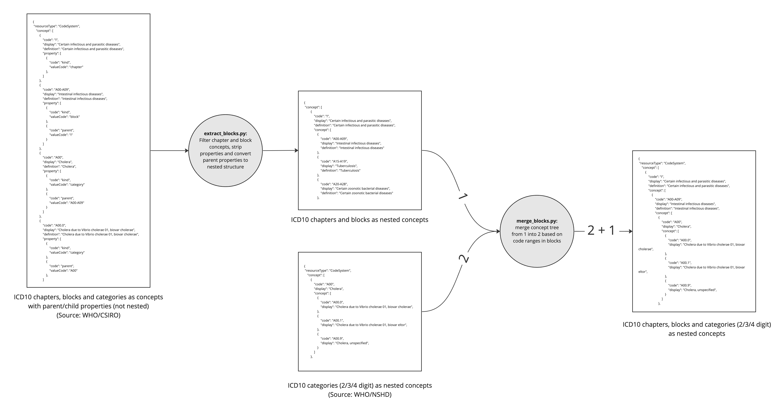

# ICD-10 Code System

# Problem

Since 2018 we have been using an ICD-10 code system resource supplied by CSIRO. This code system contains ICD-10 chapters, blocks and categories as concepts. There are several issues with the category (code) definitions, including missing codes and incorrect descriptions (see https://jira.extge.co.uk/browse/RPDS-2013 and https://jira.extge.co.uk/browse/RPDS-5401).

The content we synchronise from the NHS terminology server also includes an ICD-10 code system. This code system contains all ICD-10 categories and does not suffer from the same issues as the code system from CSIRO. But, it does not include ICD-10 chapters or blocks as concepts. The ICD-10 chapters and blocks are used in the Participant Explorer for searching and code grouping, so the Participant explorer cannot use the NHS code system resource as-is.

# Solution

We can combine the chapter and block concepts from the CSIRO code system with the NHS code system, creating a new code system resource that includes all the required concepts and is free of any issues. We use nested elements to represent the hierarchy, instead of parent/child properties, because the NHS code system also uses nesting.

We use http://hl7.org/fhir/sid/icd-10 as the code system URL, to match the existing data in the Participant Explorer. The unmodified NHS ICD-10 code system will remain available via its original URL, http://hl7.org/fhir/sid/icd-10-uk

If the NHS publishes a new version of the ICD-10 code system in the future, we may have to repeat the process to add chapters and blocks, before it can be used with the Participant Explorer.

# Implementation

The extraction of chapter and block concepts is implemented in /src/main/python/icd-10/extract_blocks.py

The merging of chapters and blocks with categories is implemented in /src/main/python/icd-10/merge_blocks.py

Diagram:

